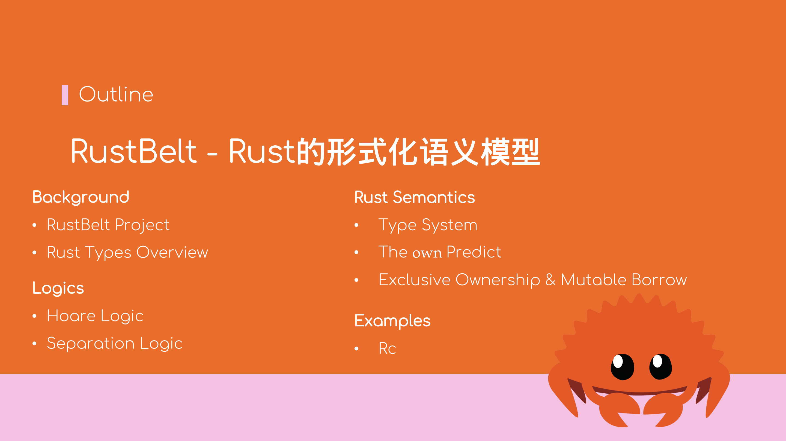

# RustBelt——Rust语言的形式化语义模型

本文根据Rust China Conf 2023大会上的议题《[RustBelt - Rust的形式化语义模型](https://www.bilibili.com/video/BV17F411o7kT/)》转录而成，转录于2023年6月23日．

其中，带\*号的部分在会中因时间关系，未提及．



## 目录
- [背景](01-background.md)
    - [RustBelt项目简介](01-background.md#rustbelt项目简介)
    - [Rust类型一览](01-background.md#rust类型一览)
- [形式化逻辑基础](02-logics.md)
    - [霍尔逻辑（Hoare Logic）](02-logics.md#霍尔逻辑hoare-logic)
    - [分离逻辑（Separation Logic (Iris)）](02-logics.md#分离逻辑separation-logic-iris)
- [Rust语义模型](03-rust-semantics.md)
    - [\\( \lambda_\textrm{Rust} \\)的类型系统（部分）](03-rust-semantics.md#-lambda_textrmrust-的类型系统部分)
    - [类型的\\( \text{own} \\) Predict](03-rust-semantics.md#类型的-textown--predict)
    - [类型的\\( \text{size} \\)属性\*](03-rust-semantics.md#类型的-textsize-属性)
    - [独占所有权（Exclusive Ownership）与可变借用](03-rust-semantics.md#独占所有权exclusive-ownership与可变借用)
    - [生存期（Lifetime）\*](03-rust-semantics.md#生存期lifetime)
    - [共享所有权（Shared Ownership）与不可变借用\*](03-rust-semantics.md#共享所有权shared-ownership与不可变借用)
- [示例`Rc`](04-rc.md)
    - [`Rc`的语义模型](04-rc.md#rc的语义模型)
    - [`Rc`的实现](04-rc.md#rc的实现)

## 现场问答环节

### 问题：RustBelt可否在实际工程项目中用于证明代码的正确性？

**回答**：可以但不建议．

RustBelt的主要目标是标准库，因为标准库中存在大量的`unsafe`代码，只有通过Iris定义的系列语法及语义规则，才能证明其健全性．

由于在RustBelt已经证明所有的\\( \lambda_\text{Rust} \\)的程序只要通过类型检查，也能满足语义上的约束，因此如果要证明某个库的实现是健全的，
需将其Rust MIR代码翻译为\\( \lambda_\text{Rust} \\)然后证明能通过类型检查，则该库的实现可以认为是健全的．[^sound]

Rust社区中还有两个可用于工程中的形式化验证工具，[Kani](https://model-checking.github.io/kani/getting-started.html)与
[Creusot](https://github.com/xldenis/creusot)．与RustBelt不同的是（笔者本人的理解）：
- Kani与Creusot主要用于验证程序的逻辑正确性；而RustBelt主要关注内存安全性与线程安全性，三者应用场景不同．
- Kani依赖Rust编译器及其标准库本身的正确性；而RustBelt无此假设，可用于验证包含标准库在内的所有\\( \lambda_\text{Rust} \\)程序的正确性；
  Creusot的实现经过了[RustHornBelt](https://dl.acm.org/doi/10.1145/3519939.3523704)的形式化验证，因此可认为不依赖Rust本身的正确性．
- Kani支持部分`unsafe`代码的验证（仅限于能通过逻辑正确性检查出来的错误，如数组下标越界等；
  Creusot目前[不支持`unsafe`代码验证](https://github.com/xldenis/creusot/issues/36)；
  RustBelt由于代码都基于MIR转写，因此支持`unsafe`代码．
- Kani目前[不支持并发代码验证](https://github.com/model-checking/kani/issues/313)；Creusot未知；
  RustBelt由于支持线程安全检查，因而也支持并发代码验证．

可根据不同的场景选用不同的形式化验证工具．

[^sound]: 实际上离程序真正的正确性还有一定距离，因为从Rust MIR到\\( \lambda_\text{Rust} \\)会丢失一些实现细节．

#### Kani简介*

Kani使用[**模型检查**](https://en.wikipedia.org/wiki/Model_checking)（Model Checking）方法，需要手动编写类似单元测试的验证用例，Kani求解器
会遍历状态空间树以检查验证用例是否正确．若不正确，将报告反例分支．

如文档中的示例代码所示
```rust,ignore
fn estimate_size(x: u32) -> u32 {
    if x < 256 {
        if x < 128 {
            return 1;
        } else {
            return 3;
        }
    } else if x < 1024 {
        if x > 1022 {
            panic!("Oh no, a failing corner case!");
        } else {
            return 5;
        }
    } else {
        if x < 2048 {
            return 7;
        } else {
            return 9;
        }
    }
}
```
验证用例的写法如下
```rust,ignore
#[cfg(kani)]
#[kani::proof]
fn check_estimate_size() {
    let x: u32 = kani::any();
    estimate_size(x);
}
```
Kani求解器将从`kani::any::<u32>()`的任意状态开始，遍历求解`estimate_size`函数并最终找到反例分支
```bash
$ cargo kani
[...]
Runtime decision procedure: 0.00116886s

RESULTS:
Check 3: estimate_size.assertion.1
         - Status: FAILURE
         - Description: "Oh no, a failing corner case!"
[...]
VERIFICATION:- FAILED
```

#### Creusot简介*

Creusot同样基于模型检查方法，但与Kani有所不同的是，可直接在程序中，为函数或特质接口，以过程宏的方式标注类似于霍尔逻辑的前置条件及后置条件．
Creusot会将带有前置条件与后置条件的代码翻译为WhyML，然后调用why3求解器验证函数实现的正确性．

如以下代码为求解`1 + 2 + ... + n`的值．
```rust,ignore
use creusot_contracts::*;

#[requires(n@ < 1000)]
#[ensures(result@ == n@ * (n@ + 1) / 2)]
pub fn sum_first_n(n: u32) -> u32 {
    let mut sum = 0;
    #[invariant(sum@ == produced.len() * (produced.len() + 1) / 2)]
    for i in 1..=n {
        sum += i;
    }
    sum
}
```
其中`#[requres(n@ < 1000)`为函数的前置条件（`n@`表示`n`在函数运行前的值），`#[ensures(result@ == n@ * (n@ + 1) / 2)]`为函数的后置条件．

特别地，程序中的`for`循环需要专门指定循环不变量（Invariant），即每一轮循环结束时都需要满足的条件．

代码中的`#[invariant(sum@ == produced.len() * (produced.len() + 1) / 2)]`表示每一轮循环结束后，`sum`的值都为前`i`项的和．

### 问题：\\( \lambda_\text{Rust} \\)中的\\( \mathbf{int} \\)类型为任意长度的整型，是否可以使用固定字长的类型（例如`i8`）？

**回答**：可以．

仿照\\( \mathbf{int} \\)的定义，可以类似地定义\\( \mathbf{int}8 \\)如下
\\[
\begin{array}{ll}
    [\\![ \mathbf{int}8 ]\\!].\\!\text{size} & \mathrel{\mathop:}= 1 \\\\
    [\\![ \mathbf{int}8 ]\\!].\\!\text{own}(\bar{v}) &
        \mathrel{\mathop:}= \\; \exists z \in \mathbb{Z} \cap \left[ -2^7, 2^7 \right). \bar{v} = [z]
\end{array}
\\]
即为\\( \mathbf{int} \\)类型增加\\( \left[ -2^7, 2^7 \right) \\)的约束，再为\\( \mathbf{int}8 \\)类型实现相应的算术计算如
\\[
\begin{array}{l}
    \text{add_i8} : \mathbf{int}8 \times \mathbf{int}8 \to \mathbf{int}8 \mathrel{\mathop:}= 
        \lambda (a, b). \\; (a + b + 2^8) \\!\\! \mod \\! 2^8 - 2^7 \\\\ 
    \text{sub_i8} : \mathbf{int}8 \times \mathbf{int}8 \to \mathbf{int}8 \mathrel{\mathop:}=
        \lambda (a, b). \\; (a - b + 2^8) \\!\\! \mod \\! 2^8 - 2^7
\end{array}
\\]
即可．
