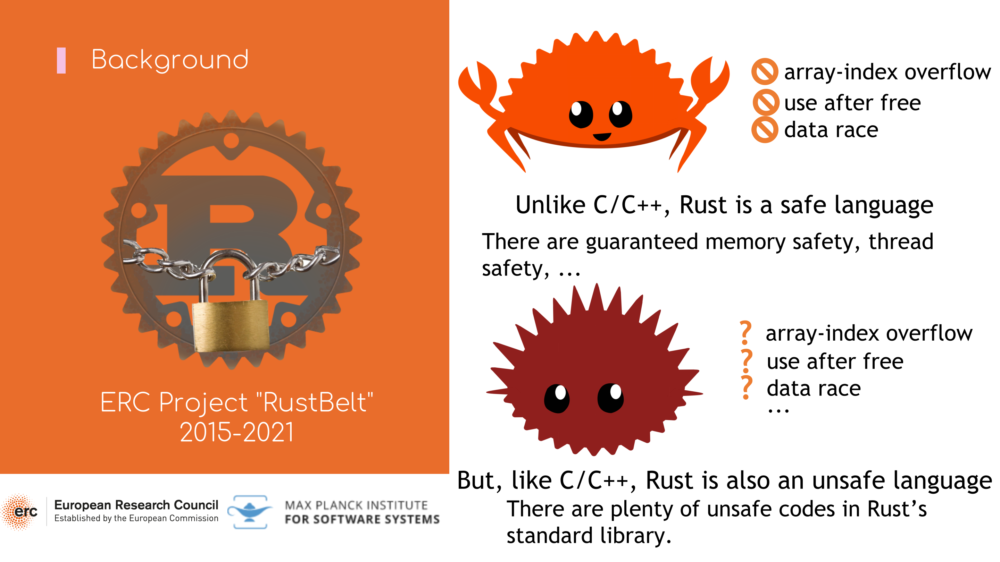
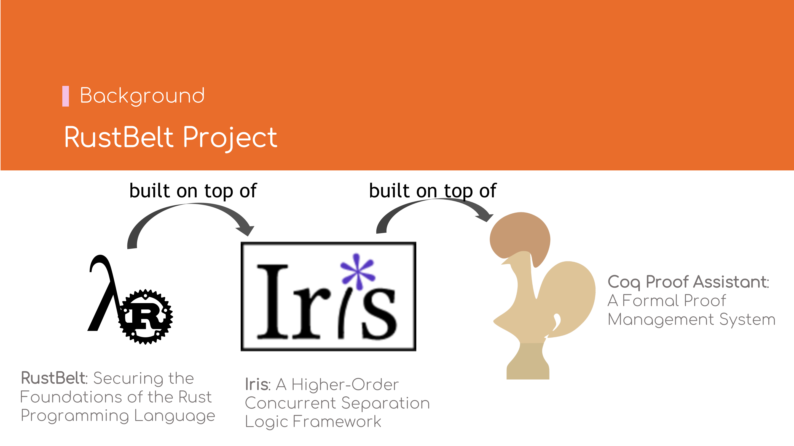

# 背景

## RustBelt项目简介

众所周知，Rust是一门内存安全的语言，只要通过编译，便能避免数组下标越界、Use After
Free、数据竞争等[未定义行为](https://doc.rust-lang.org/reference/behavior-considered-undefined.html)．
但同时，Rust也是一门不安全的语言，使用`unsafe`关键字时，
上述内存安全问题都需要自行保证．

而Rust标准库中，使用了大量的`unsafe`功能，因此Rust语言安全与否，
与标准库实现是否**健全**（Sound）——任意调用`pub`接口（非`unsafe`）都不能触发[**未定义行为**](https://doc.rust-lang.org/reference/behavior-considered-undefined.html)
（Undefined Behavior）——密切相关．

[RustBelt](https://plv.mpi-sws.org/rustbelt/)项目正是在如此背景下提出，旨在以形式化的方式验证标准库中常用基础类型实现的正确性．

RustBelt项目的主要贡献者之一——[Ralf Jung教授](https://research.ralfj.de/)
是瑞士苏黎世联邦理工大学（ETH Zürich）的助理教授．其中最主要的论文是2018年发表在POPL杂志上的
[《RustBelt: Securing the Foundations of the Rust Programming Language》](https://plv.mpi-sws.org/rustbelt/popl18/)，
也是Ralf Jung教授博士论文[《Understanding and Evolving the Rust Programming Language》](https://research.ralfj.de/thesis.html)
中的第二章．该博士论文荣获多个奖项．

RustBelt定义了\\( \lambda_\textrm{Rust} \\)-calculus，\\( \lambda_\textrm{Rust} \\)
完全经机器证明，基于[Iris](https://iris-project.org/)高阶并发分离逻辑开发；
而Iris基于[Coq Proof Assistant](https://coq.inria.fr/)开发．

## Rust类型一览

Rust语言的类型具有所有权语义：值类型可以被任意创建、移动、或释放，但每个值最多只能被「使用」
一次——这也是[**仿射类型系统**](https://en.wikipedia.org/wiki/Substructural_type_system#Affine_type_systems)（Affine Type Systems）
的典型特征．但若只有值类型，由于有只能使用一次的限制，那么很难编写具有实际意义的程序．

所幸Rust语言中也提供了[**引用类型**](https://doc.rust-lang.org/std/primitive.reference.html)（Reference），
分为**可变引用**（Mutable Refernece，`&'a mut T`）与**不可变引用**（Immutable Reference，`&'a T`，也称共享引用，Shared Reference）．
引用类型可以由值类型`T`**借用**（Borrow）而得，**可变借用**（Mutable Borrow）得到可变引用，**不可变借用**（Immutable Borrow）得到不可变引用．
引用类型也可以**再借用**（Reborrow）以得到另一个[**生存期**](03-rust-semantics.md#生存期lifetime)
（Lifetime）更小的引用类型．可变引用也可以[**隐式转换**](https://doc.rust-lang.org/reference/type-coercions.html#coercion-types)（Coercion）到不可变引用．

从独占/共享的维度来看，值类型`T`与可变引用`&mut T`属于独占类型，即同一代码位置，对同一个值，
只能有**唯一**、**有效**的**读写**权限；而不可变引用`&T`属于共享类型，即同一代码位置，对同一个值，
允许有**多个**有效的**只读**权限．
独占访问与共享访问是互斥的，二者只有其中一个有效．

从所有/借用的维度来看，值类型`T`持有值的所有权，而可变引用`&mut T`与不可变引用`&T`
只有借用权．持所有权者，拥有完整的**读**、**写**、**移动**、**释放**权限；而持借用权者，
只有**读写**（可变引用）或**只读**（不可变引用）权限．

