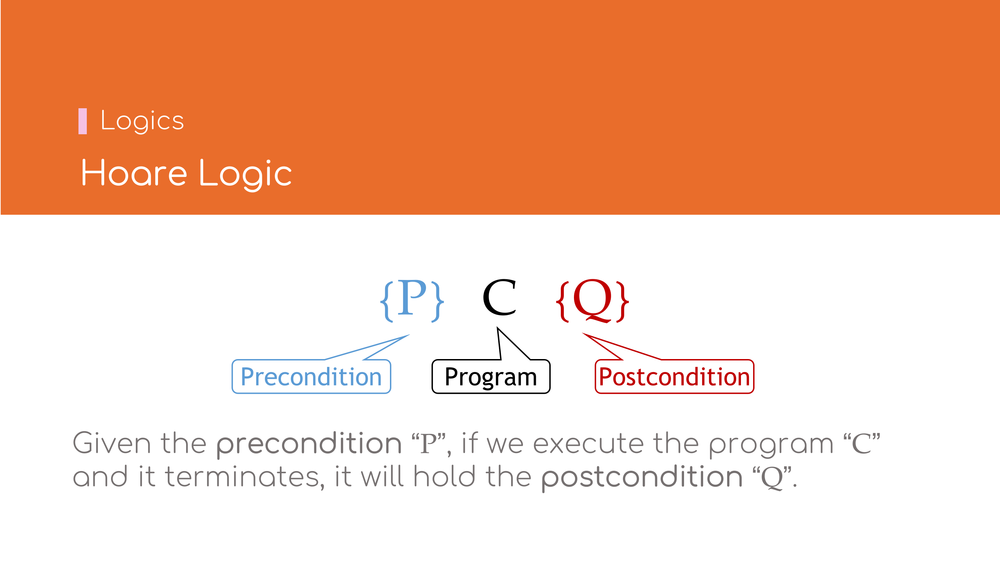
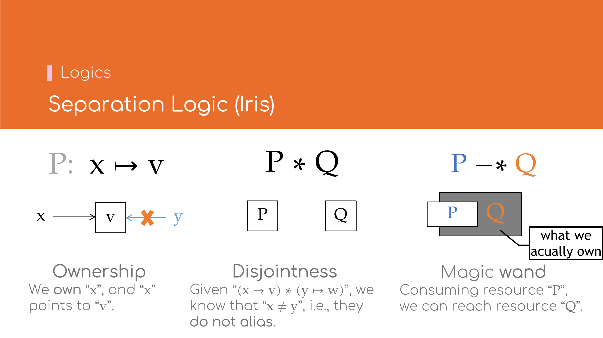

# 形式化逻辑基础

下面将介绍形式化逻辑中常用的两个基础概念．

## 霍尔逻辑（Hoare Logic）



[霍尔逻辑](https://en.wikipedia.org/wiki/Hoare_logic)中的命题\\( \lbrace P \rbrace \\; C \\; \lbrace Q \rbrace \\)是指，
对于某一段程序\\( C \\)，在前置条件\\( P \\)成立的情况下，若正常执行并停机，那么应当满足后置条件\\( Q \\)．

霍尔逻辑与程序开发过程中的单元测试的概念类似．
若以单元测试来类比，程序\\( C \\)相当于单元测试中的被测函数；
前置条件\\( P \\)相当于单元测试中的输入参数；后置条件\\( Q \\)相当于单元测试中的断言．


霍尔逻辑示例:
- \\[ \lbrace \mathsf{True} \rbrace \\; \mathbf{let} \\, x = 10 \\; \lbrace x = 10 \rbrace \\]
  表示程序\\( \\; \mathbf{let} \\, x = 10 \\)无需任何前置条件，在运行结束后得到后置条件\\( x = 10 \\)．
- \\[ \lbrace x = 3 \rbrace \\; x \\,+\\!= 1 \\; \lbrace x = 4 \rbrace \\]
  表示程序\\( x \\, + \\! = 1 \\) 在\\( x = 3 \\)的前置条件下，运行结束后会得到后置条件\\( x = 4 \\)．
- \\[ \lbrace \mathsf{True} \rbrace \\; \mathbf{loop} \\, \lbrace \\! \rbrace \\; \lbrace \mathsf{False} \rbrace \\]
  表示程序\\( \mathbf{loop} \\, \lbrace \\! \rbrace \\)无需任何前置条件，但永不停机（假设它真的停机了，那么会得到一个假命题
  \\( \mathsf{False} \\)即为其后置条件）．

## 分离逻辑（Separation Logic (Iris)）



[分离逻辑](https://en.wikipedia.org/wiki/Separation_logic)可看作霍尔逻辑的扩展，用以表达内存中**独占**（Ownership）与
**不交**（Disjointness）的两个性质．

### Ownership

命题\\( x \mapsto v \\)表示内存地址\\( x \\)唯一地指向了值\\( v \\)．

### Disjointness

命题\\( P \ast Q \\)表达了\\( P \\)与\\( Q \\)在内存空间上不相交．例如给定\\( (x \mapsto v) \ast (y \mapsto w) \\)，
则知\\( x \ne y \\)，因为\\( x \\)与\\( y \\)不能指代同一内存地址（not alias）．


\\( \ast \\)与\\( \land \\)的区别:
- \\[ (x \mapsto v) \land (x \mapsto w) \implies v = w \\]
  资源是唯一的，因此仅存在唯一的值\\(v\\)使得\\(x \mapsto v\\)．
- \\[ (x \mapsto v) \ast (x \mapsto v) \implies \mathsf{False} \\]
  资源是不可复制的，因此即使是同一个值\\(v\\)，也不能同时存在两份相同的资源\\(x \mapsto v\\)．
- \\[ (x = 1) \ast (y = 2) \iff (x = 1) \land (y = 2) \\]
  对于**非资源**或者[**永久资源**](#永久资源persistent)，\\( \ast \\)与\\( \land \\)是等价的．

### Magic Wand

命题\\( P -\\!\ast\\, Q \\)表示若消耗掉资源\\( P \\)则可获得资源\\( Q \\)．它与逻辑命题中「蕴含（Implies，\\( \Rightarrow \\)）」
的概念较为相似，如\\( P \ast (P -\\! \ast \\, Q) \vdash Q \\)之于\\( P \land (P \Rightarrow Q) \vdash Q \\)．

注意此处的资源\\(P\\)不必包含在资源\\(Q\\)中．

### Accessor资源访问模式（经大幅简化）*


命题\\( Q \propto P \\, \mathrel{\mathop:}= \\, Q -\\!\ast\\, \big( P \ast (P -\\!\ast\\, Q) \big)\\)表示：在较大的资源\\(Q\\)中，
可以临时取出包含于\\(Q\\)的较小资源\\(P\\)，待\\(P\\)使用结束后，归还\\(P\\)则可重新获得原资源\\(Q\\)．

通常，资源\\(Q\\)都完全包含资源\\(P\\)．Accessor是一种访问资源的模式，当某一较大资源不便于直接拆分为两个较小的资源以\\(\ast\\)相连的形式时，
比较适合使用Accessor模式．

### 永久资源（Persistent）*


命题\\( P \\; \mathsf{Persistent} \\, \mathrel{\mathop:}= \\, P -\\!\ast\\, P \ast P \\)表示资源\\(P\\)永不耗尽，可任意复制．永久资源又称
**知识（Knowledge)** 或**信息（Information)**．如\\(1 + 1 = 2\\)，\\( x = 1 \implies x + 1 = 2 \\)，
\\( \lbrace \mathsf{True} \rbrace \\; \mathbf{let} \\, x = 10 \\; \lbrace x = 10 \rbrace \\) 等．注意霍尔逻辑作为复合命题，也属于永久资源．

---


分离逻辑的示例:
- \\[ \lbrace \mathsf{True} \rbrace \\; \mathbf{let} \\, x = \text{Box::new}(1) \\; \lbrace x \mapsto 1 \rbrace \\]
表示程序\\( x = \textrm{Box::new}(1) \\)无需任何前置条件，在运行结束后获得资源\\( x \mapsto 1 \\)[^dealloc]．这里\\( \mapsto \\)的独占语义
与Rust中`Box`类型的语义一致．
- \\[ \big\lbrace (x \mapsto 1) \ast (y \mapsto 1) \big\rbrace \\; {\mbox*} x \\,+\\!= {\mbox*} y \\; 
    \big\lbrace (x \mapsto 2) \ast (y \mapsto 1) \big\rbrace \\]
  表示程序\\( {\mbox*} x \\,+\\!= {\mbox*} y \\)在前置条件\\( \big\lbrace (x \mapsto 1) \ast (y \mapsto 1) \big\rbrace \\)下，
  运行结束后将得到\\( \big\lbrace (x \mapsto 2) \ast (y \mapsto 1) \big\rbrace \\)．注意 \\( (x \mapsto 1) \ast (y \mapsto 1) \\) 
  表明\\(x\\)与\\(y\\)的地址不可能相同，与Rust代码
  ```rust,ignore
  fn add(x: &mut i32, y: &i32) {
      *x += *y;
  }
  ```
  的语义一致．
- \\[ \lbrace x \mapsto - \rbrace \\; \text{drop}(x) \\; \lbrace \mathsf{True} \rbrace \\]
  表示程序\\( \text{drop}(x) \\)在\\( \lbrace x \mapsto - \rbrace \\)的前置条件下，运行结束后将消耗掉该资源．其中\\( \lbrace x \mapsto - 
  \rbrace \\)表示不关心地址\\(x\\)具体指向什么值．

[^dealloc]: 此处省略了内存释放的部分．

