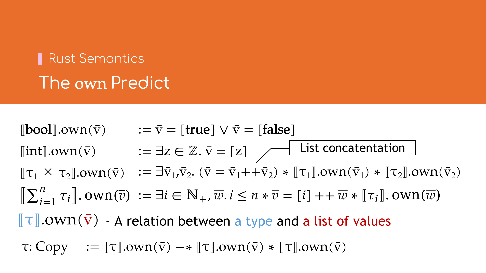
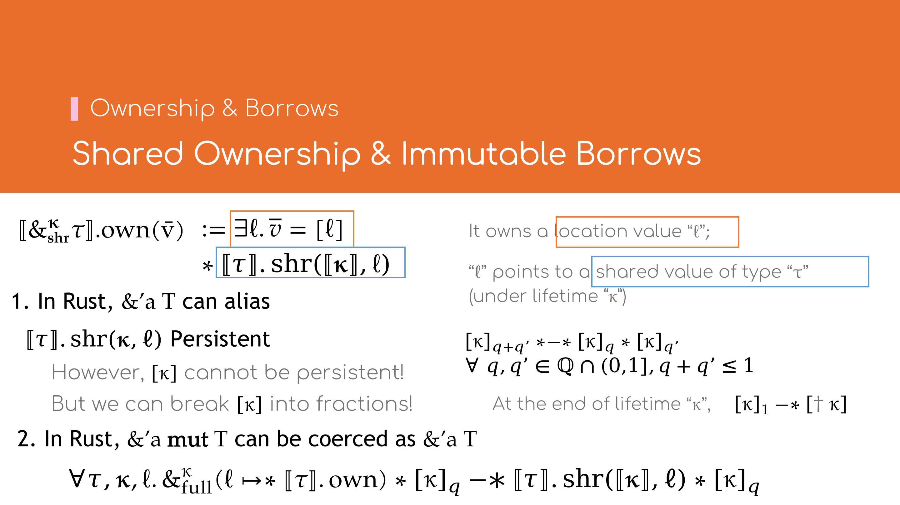

# Rust语义模型

## \\( \lambda_\textrm{Rust} \\)的类型系统（部分）[^types]


\\[
\begin{array}{lll}
    \text{值}     & \text{Val}  & \ni v \mathrel{\mathop:\\!\\!:}= \mathbf{false} \\; | \\; \mathbf{true} \\; | \\; z \\; | \\; \ell \\; | \cdots \\\\
    \text{生存期} & \text{Lft}  & \ni \kappa \mathrel{\mathop:\\!\\!:}= \alpha \\; | \\; \mathbf{static} \\\\
    \text{可变性} & \text{Mod}  & \ni \mu    \mathrel{\mathop:\\!\\!:}= \mathbf{mut} \\; | \\; \mathbf{shr} \\\\
    \text{类型}   & \text{Type} & \ni \tau   \mathrel{\mathop:\\!\\!:}= T \\; | \\; \mathbf{bool} \\; | \\; \mathbf{int} \\\\
                && \quad | \\; \mathbf{own} \\, T \\; | \\; \\&_\mu^\kappa T \\\\
                && \quad | \\; \prod \bar{\tau} \\; | \\; \sum \bar{\tau} \\; | \cdots
\end{array}
\\]

常用的Rust类型与\\( \lambda_\textrm{Rust} \\)类型的对照关系如下表所示：

| \\( \lambda_\textrm{Rust} \\)类型                                            | Rust类型                                              |
|------------------------------------------------------------------------------|-------------------------------------------------------|
| \\( \mathbf{bool} \\; \| \\; \mathbf{int} \\)                                | `bool` \| `BigInt`                                    |
| \\( \mathbf{own} \\, T \\)                                                   | `Box<T>`                                              |
| \\( \\&\_{\mathbf{mut}}^\alpha T \\; \| \\; \\&\_{\mathbf{shr}}^\alpha T \\) | `&'a mut T` \| `&'a T`                                |
| \\( \tau\_1 \times \tau\_2 \\; \| \\; \prod [] \\)                           | `(T1, T2)` \| `()`                                    |
| \\( \tau\_1 + \tau\_2 \\; \| \\; \sum [] \\)                                 | `enum Type { A(T1), B(T2) }` \| `enum Type {}` 或 `!` |
| \\( \prod [] + \tau \\)                                                      | `Option<T>`                                           |

其中：
- \\( \lambda_\textrm{Rust} \\)的\\( \mathbf{int} \\)类型为忽略机器字长的任意大小的整型；
- \\( \lambda_\textrm{Rust} \\)的**积类型**（Product Type，\\( \prod \bar{\tau} \\)）相当于Rust的**元组**（Tuple）或**结构体**（Struct）类型；
- \\( \lambda_\textrm{Rust} \\)的**和类型**（Sum Type，\\( \sum \bar{\tau} \\)）相当于Rust的**枚举**（Enum）类型；
- \\( \lambda_\textrm{Rust} \\)的单位积类型（\\( \prod [] \\)）相当于Rust的**单元**（Unit）类型（`()`）；
- \\( \lambda_\textrm{Rust} \\)的单位和类型（\\( \sum [] \\)）相当于Rust的空枚举类型（`enum Type {}`）或Never类型（`!`）．

[^types]: \\( \lambda_\text{Rust} \\)基于Rust中的[MIR](https://rustc-dev-guide.rust-lang.org/mir/index.html)，其表达式的语法与Rust不同，更接近[\\(\lambda\\)-calculus](https://en.wikipedia.org/wiki/Lambda_calculus)的语法．这里简单起见直接用使用类Rust的语法．

## 类型的\\( \text{own} \\) Predict 



以几个简单类型为例，说明\\( \text{own} \\) predict的含义：

- \\[
    [\\![ \mathbf{bool} ]\\!].\\!\text{own}(\bar{v}) \\; \mathrel{\mathop:}= \\; \bar{v} = [\mathbf{true}] \lor \bar{v} = [\mathbf{false}]
\\]
  即属于布尔类型\\(\mathbf{bool}\\)的值\\(\bar{v}\\)要么为单个值\\(\mathbf{false}\\)，要么为单个值\\(\mathbf{true}\\)．
- \\[ [\\![ \mathbf{int}  ]\\!].\\!\text{own}(\bar{v}) \\; \mathrel{\mathop:}= \\; \exists z \in \mathbb{Z}. \bar{v} = [z] \\]
  即属于整型\\(\mathbf{int}\\)的值\\(\bar{v}\\)为单个整数\\(z\\)．
- \\[
    [\\![ \tau_1 \times \tau_2 ]\\!].\\!\text{own}(\bar{v}) \\; \mathrel{\mathop:}= \\;
        \exists \bar{v}_1, \bar{v}_2. (\bar{v} = \bar{v}_1 +\\!+ \\, \bar{v}_2) \ast
        [\\![ \tau_1 ]\\!].\\!\text{own}(\bar{v}_1) \ast [\\![ \tau_2 ]\\!].\\!\text{own}(\bar{v}_2)
\\]
  即属于积类型\\( \tau_1 \times \tau_2 \\)的值\\(\bar{v}\\)为分别属于两个类型\\(\tau_1\\)与\\(\tau_2\\)的值
  \\(\bar{v}_1\\)与\\(\bar{v}_2\\)相连．此处的\\(+\\!+\\)为列表连接（Concentation）运算．
- \\[
     \left[\\!\\!\left[ \sum_{i=0}^{n-1} \tau_i \right]\\!\\!\right].\\!\text{own}(\bar{v}) \\; \mathrel{\mathop:}= \\;
        \exists i \in \mathbb{N}, \bar{w}. (i < n) \ast (\bar{v} = [i] +\\!+ \\, \bar{w}) \ast [\\![ \tau_i ]\\!].\\!\text{own}(\bar{w})
\\]
  即属于和类型\\( \sum_{i=1}^n \tau_i \\)的值\\(\bar{v}\\)为一个自然数\\(i\\)代表其枚举变体（Variant）序号，与一个属于类型
  \\(\tau_i\\)的值\\(\bar{w}\\)相连．

因此，\\( [\\![ \tau ]\\!].\\!\text{own}(\bar{v}) \\)表示类型\\(\tau\\)对值列表\\(\bar{v}\\)的约束关系[^conc]．

联想到Rust中的[`Copy`**特质**](https://doc.rust-lang.org/std/marker/trait.Copy.html)（Trait），
可以定义\\( \lambda_\textrm{Rust} \\)中的\\( \mathsf{Copy} \\)语义如下：
\\[
    \tau: \mathsf{Copy} \\; \mathrel{\mathop:}= \\; [\\![ \tau ]\\!].\\!\text{own}(\bar{v}) \\; \mathsf{Persistent}
\\]
即当类型\\(\tau\\)不含任何资源时，它才是\\(\mathsf{Copy}\\)的．

[^conc]: 省略了多线程的部分．

## 类型的\\( \text{size} \\)属性*


在不考虑[**动态大小类型**（Dynamically Sized Types, DST）](https://doc.rust-lang.org/reference/dynamically-sized-types.html)
的情况下，每一个Rust类型都确定的内存大小，而在\\( \lambda_\textrm{Rust} \\)中也有类似的属性．

常见类型的\\( \text{size} \\)属性如下：
- \\( [\\![ \mathbf{bool} ]\\!].\\!\text{size} \mathrel{\mathop:}= 1 \\)
- \\( [\\![ \mathbf{int} ]\\!].\\!\text{size} \mathrel{\mathop:}= 1 \\)
- \\( [\\![ \mathbf{own} \\, \tau ]\\!].\\!\text{size} \mathrel{\mathop:}= 1 \\)
- \\( [\\![ \\&\_\mathbf{mut}^\kappa \tau ]\\!].\\!\text{size} \mathrel{\mathop:}= 1 \\)
- \\( [\\![ \\&\_\mathbf{shr}^\kappa \tau ]\\!].\\!\text{size} \mathrel{\mathop:}= 1 \\)
- \\( [\\![ \tau\_1 \times \tau\_2 ]\\!].\\!\text{size} \mathrel{\mathop:}=
     [\\![ \tau\_1 ]\\!].\\!\text{size} + [\\![ \tau\_2 ]\\!].\\!\text{size} \\)
- \\(
     \left[\\!\left[ \sum_i \tau_i \right]\\!\right].\\!\text{size} \mathrel{\mathop:}= 1 + \displaystyle \max_i [\\![ \tau\_i ]\\!].\\!\text{size}
\\)

此外，类型的\\( \text{size} \\)属性还须与\\( \text{own} \\) predict所关联的值列表的长度保持一致，即：
\\[ \forall \tau, \bar{v}. [\\![ \tau ]\\!].\\!\text{own}(\bar{v}) \\; -\\!\ast \\; |\bar{v}| = [\\![ \tau ]\\!].\\!\text{size} \\]

## 独占所有权（Exclusive Ownership）与可变借用


### `Box<T>`

对于`Box<T>`类型，其\\( \text{own} \\) predict相比\\(\mathbf{int}\\)等简单类型更加复杂．
\\[
\begin{array}{lll}
    [\\![ \mathbf{own} \\, \tau ]\\!].\\!\text{own}(\bar{v}) 
        & \mathrel{\mathop:}= \\, \exists \ell. \bar{v} = [\ell] 
        & \bar{v} \text{是单个地址值} \ell \\\\
        & \ast \\, \exists \bar{w}. \ell \mapsto \bar{w} \ast [\\![ \tau ]\\!].\\!\text{own}(\bar{w})
        & \ell \text{指向属于类型} \tau \text{的值} \bar{w} \\\\
        & \ast \\, \mathsf{Dealloc}(\ell, [\\![ \tau ]\\!].\\!\text{size})
        & \text{允许释放以} \ell \text{开始，长度为} [\\![ \tau ]\\!].\\!\text{size} \text{的内存}
\end{array}
\\]
若将\\( \exists \bar{w}. \ell \mapsto \bar{w} \ast [\\![ \tau ]\\!].\\!\text{own}(\bar{w}) \\)简写为
\\( \ell \mapsto \\!\\! \ast \\, [\\![ \tau ]\\!].\\!\text{own} \\) （即此时并不关心具体的值\\(\bar{w}\\)），那么上式可简化为
\\[
    [\\![ \mathbf{own} \\, \tau ]\\!].\\!\text{own}(\bar{v}) \\, \mathrel{\mathop:}= \\, \exists \ell. (\bar{v} = [\ell])
        \ast (\ell \mapsto \\!\\! \ast \\, [\\![ \tau ]\\!].\\!\text{own})
        \ast \mathsf{Dealloc}(\ell, [\\![ \tau ]\\!].\\!\text{size})
\\]

### `&'a mut T`

`&'a mut T`类型与`Box<T>`很相似，其\\( \text{own} \\) predict如下：
\\[
\begin{array}{lll}
    \left[\\!\left[ \\&\_\mathbf{mut}^\kappa \tau \right]\\!\right]\\!.\\!\text{own}(\bar{v}) 
        & \mathrel{\mathop:}= \\, \exists \ell. \bar{v} = [\ell] 
        & \bar{v} \text{是单个地址值} \ell \\\\
        & \ast \\, \\&\_\mathsf{full}^\kappa \big( \ell \mapsto \\!\\! \ast \\, [\\![ \tau ]\\!].\\!\text{own} \big)
        & \text{在生存期} \kappa \text{的完全借用范围内，} \ell \text{指向属于类型} \tau \text{的值}
\end{array}
\\]

比较\\( [\\![ \mathbf{own} \\, \tau ]\\!].\\!\text{own}(\bar{v}) \\)与
\\( \left[\\!\left[ \\&\_\mathbf{mut}^\kappa \tau \right]\\!\right]\\!.\\!\text{own}(\bar{v}) \\)可以发现：
- \\( \exists \ell. \bar{v} = [\ell] \\)表明二者都是单个地址值；
- \\( \ell \mapsto \\!\\! \ast \\, [\\![ \tau ]\\!].\\!\text{own} \\)表明二者都指向属于类型\\(\tau\\)的值，但
  \\( \\&\_\mathbf{mut}^\kappa \tau \\)类型有生存期\\( \kappa \\)的约束范围．

### 独占的可变借用

\\( \\&\_\mathsf{full}^\kappa P \\) 表示对资源\\(P\\)的独占借用，生存期为\\(\kappa\\)．它可通过资源\\(P\\)任意创建
\\[ P \\, -\\!\ast\\; \\&\_\mathsf{full}^\kappa P \ast \big( [\dagger \kappa] -\\!\ast\\, P \big) \\]
可见，创建\\( \\&\_\mathsf{full}^\kappa P \\)需要消耗𠩤来的资源\\(P\\)；且仅当生存期\\(\kappa\\)结束时（即获取\\([\dagger\kappa]\\)后），
才能再次归还资源\\(P\\)．

这与在Rust语言中
```rust,ignore
let mut x: Box<T> = /* ... */;
{
    let y: &'a mut T = &mut *x; // 'a <-+
    // `x` is not accessible            |
    use(y); //                          |
} // `'a` ends <------------------------+
access(x); // `x` is accessible again
```
可变借用`&mut *x`得到`&'a mut T`的语义一致，即在`y: &'a mut T`存续期间，原有`x`的值不可再访问；仅当`'a`结束后，再重新归还`x`的所有权．

## 生存期（Lifetime）*


上文中提到生存期结束时的\\( [\dagger \kappa] \\) token，接下来将简单介绍一下\\( \lambda_\textrm{Rust} \\)中生存期的表示．

### 什么是生存期？

C++或其他编程语言中，[生存期](https://en.cppreference.com/w/cpp/language/lifetime)一般是指变量或对象从创建开始到销毁的一段时间，
是**运行时**（Runtime）的概念．C++中生存期偶尔也指[RAII](https://en.cppreference.com/w/cpp/language/raii)对象所属的作用域，
因为这类对象的创建与释放与其作用域绑定在一起．

而Rust中的[生存期](https://doc.rust-lang.org/nomicon/lifetimes.html)概念则有所不同，更多是指引用类型或者借用的有效期，是**抽象语法树**
（Abstract Syntax Tree，AST）或者**控制流图**（Control-Flow Graph，CFG）上的概念而非运行时的概念．

最简单的理解是把生存期近似看作**作用域**（scope）[^scope]，如以下代码段所示
```rust,ignore
let mut x = Box::new(1);
'a: {
    let y = &'a mut x; // start of 'a <--+
    *y += 1; //                          |
} // end of `'a` <-----------------------+
```
生存期随新的作用域打开而开始，随作用域关闭而结束．

在\\( \lambda_\textrm{Rust} \\)中，生存期的开始及结束与Rust类似：
\\[ 
\begin{array}{lll}
    \mathsf{True} & -\\!\ast\\, \exists \kappa. [\kappa] 
        & \text{生存期} \kappa \text{开始时，新建一个token } [\kappa] \text{，该token代表生存期} \kappa \text{存活}  \\\\
        & \ast\\; \big([\kappa] -\\!\ast\\, [\dagger \kappa]\big) 
        & \text{生存期} \kappa \text{结束时，消耗原token } [\kappa] \text{后，得到生存期结束的token } [\dagger \kappa]
\end{array}
\\]
这里生存期结束的token\\([\dagger \kappa]\\)是永久的，即
\\[ [\dagger \kappa] \\; \mathsf{Persistent} \\]
这是因为生存期一旦结束，便已成定局，所以此处的token将永久存在，不被消耗．

[^scope]: 后来Rust引入了[**非词法作用域生存期**（Non-Lexical Lifetime，NLL）](https://rust-lang.github.io/rfcs/2094-nll.html)，使得
生存期不再与作用域绑定．

### 生存期的包含关系（Lifetime Inclusion，`'b: 'a`）

在Rust中，`'b: 'a`表示生存期`'b`比`'a`更长（或等长），这是因为通常情况下带更长生存期类型是带更短生存期类型的子类型[^covar]，如当`'b: 'a`
时，`&'b T`是`&'a T`的[**子类型**](https://doc.rust-lang.org/reference/subtyping.html#subtyping-and-variance)
（Subtype），即`&'b T: &'a T`．

生存期的包含关系是一个[**偏序关系**](https://en.wikipedia.org/wiki/Partially_ordered_set)
（Partial Order Relationship），即满足
- 自反性（Reflexive），对任意的`'a`都有：`'a: 'a`；
- 传递性（Transitive），若`'a: 'b`且`'b: 'c`那么有`'a: 'c`．
- 反对称性（Anti-Symmetric），若`'a: 'b`且`'b: 'a`那么`'a = 'b`.

不同于[**全序关系**](https://en.wikipedia.org/wiki/Total_order)
（Total Order）的是，并非任意两个生存期都存在包含关系，如以下的`'a`与`'b`既不满足`'a: 'b`也不满足`'b: 'a`．
```rust,ignore
'a: { } // lifetime `'a`
'b: { } // lifetime `'b`
```

当我们提到生存期`'b`比`'a`更长时，一般有两层含义．如下列代码段所示
```rust,ignore
'b: { // `'b` alive
    'a: { // `'a`, `'b` alive
        // ...
    } // `'a` ends
} // `'a`, `'b` end
```
- 若较短的生存期`'a`存活，那么较长的生存期`'b`也一定存活；
- 若较长的生存期`'b`结束，那么较短的生存期`'a`也一定结束．

在\\( \lambda_\textrm{Rust} \\)中，生存期的包含关系略微有点复杂，但也与上述两层含义一一对应
\\[
\begin{array}{ll}
    \alpha \sqsubseteq \beta \mathrel{\mathop:}= \\\\
        \quad [\alpha] \propto [\beta]
        & \text{拥有较短生存期} \alpha \text{的token时，可通过Accessor模式临时获取较长生存期} \beta \text{的token} \\\\
        \quad \ast\\, ([\dagger \beta] -\\!\ast\\, [\dagger \alpha])
        & \text{当较长的生存期} \beta \text{结束时，也可得知较短的生存期} \alpha \text{也一定结束}
\end{array}
\\]
注意这里较短的生存期token是「更大」的资源．因为当生存期存活时，可以推断出任何比它长的生存期都存活，也即上述定义中的第一项，可以通过
[Accessor资源访问模式](02-logics.md#accessor资源访问模式经大幅简化)来获取任意一个比它更长的生存期的token．

[^covar]: 这里指[**协变**（Covariant）](https://doc.rust-lang.org/reference/subtyping.html#variance)类型中的生存期参数．

### 静态生存期（`'static`）

在Rust语言中，有一个特殊的生存期`'static`，它比其他任何生存期都更长，即在整个程序中任意作用域（包括静态作用域）范围内都存活．
```rust,ignore
static STR: &'static str = "Hello, world!".
```

在\\( \lambda_\textrm{Rust} \\)中，以\\(\varepsilon\\)代指静态生存期，则有
\\[
\begin{array}{ll}
    \mathsf{True} -\\!\ast\\, [\varepsilon] & \text{可任意获取生存期} \varepsilon \text{存活的token} \\\\
    [\dagger \varepsilon] -\\!\ast\\, \mathsf{False} & \text{生存期} \varepsilon \text{永不结束}
\end{array}
\\]

### 生存期token的拆分

由于生存期token不属于[永久资源](02-logics.md#永久资源persistent)，即不可复制，但很多时候生存期的token需要在多处使用
（如共属于同一作用域的多个引用类型），因此需要一种生存期token的复用方式．

Iris中通常使用有理拆分的方式，将一个完整的生存期token\\([\kappa]\\)，拆分成多个不完整的token，从而使得同一个生存期token可以在多处使用．

赋予每个token一个有理份额\\(q\\)，即\\([\kappa]\_q\\)，其中\\(q\\)为不大于\\(1\\)的正有理数．当\\(q = 1\\)时，即\\([\kappa]\_1\\)为完整
token；当\\(q < 1\\)时，\\([\kappa]\_q\\)为不完整token．拆分规则如下[^ast]：
\\[
    \forall \kappa. \forall q, q' \in \mathbb{Q}\_{+}. q + q' \le 1 \implies [\kappa]\_{q + q'} \ast\\!-\\!\ast\\, [k]\_q \ast [k]\_{q'}
\\]

相应地，前文提到的生存期的几个规则将变为：
\\[
    \mathsf{True} -\\!\ast\\, \exists \kappa. [\kappa]_1 \ast \big([\kappa]_1 -\\!\ast\\, [\dagger \kappa]\big) 
\\]
即生存期的开始与结束仍然需要完整的token．令\\( \mathbb{Q}\_1 \mathrel{\mathop:}= \mathbb{Q} \cap (0, 1] \\)，
\\[
\begin{array}{ll}
    \alpha \sqsubseteq \beta & \mathrel{\mathop:}= \\,
    (\forall q \in \mathbb{Q}\_1. [\alpha]\_q) \propto (\forall q' \in \mathbb{Q}\_1. [\beta]\_{q'}) \\\\
    & \ast\\, ([\dagger \beta] -\\!\ast\\, [\dagger \alpha])
\end{array}
\\]
此时可使用不完整token，并且在Accessor资源访问模式中允许任意变换token的份额．

## 共享所有权（Shared Ownership）与不可变借用*



### `&'a T`与类型的\\( \text{shr} \\) Predict

`&'a T`类型与`&'a mut T`差别较大，\\( \lambda_\textrm{Rust} \\)引入了\\( \text{shr} \\) predict代表值的共享关系，
\\( \\&\_\mathbf{shr}^\kappa \tau \\)类型的\\( \text{own} \\) predict可定义如下：
\\[
\begin{array}{lll}
    \left[\\!\left[ \\&\_\mathbf{shr}^\kappa \tau \right]\\!\right]\\!.\\!\text{own}(\bar{v}) 
        & \mathrel{\mathop:}= \\, \exists \ell. \bar{v} = [\ell] 
        & \bar{v} \text{是单个地址值} \ell \\\\
        & \ast \\, [\\![ \tau ]\\!].\\!\text{shr}(\kappa, \ell)
        & \text{在生存期} \kappa \text{存活的范围内，} \ell \text{共享了属于类型} \tau \text{的值}
\end{array}
\\]

由于Rust中的`&'a T: Copy`，因此\\( \\&\_\mathbf{shr}^\kappa \tau \\)类型的\\( \text{own} \\) predict须是永久的，于是任意类型\\(\tau\\)的
\\( \text{shr} \\) predict都须是永久的，即
\\[ \forall \tau, \kappa, \ell. [\\![ \tau ]\\!].\\!\text{shr}(\kappa, \ell) \\; \mathsf{Persistent} \\]

此外，\\( \text{shr} \\) predict还须支持生存期的包含关系，有
\\[
\forall \tau, \kappa, \kappa', \ell. \kappa' \sqsubseteq \kappa
    \ast [\\![ \tau ]\\!].\\!\text{shr}(\kappa, \ell)
    -\\!\ast\\, [\\![ \tau ]\\!].\\!\text{shr}(\kappa', \ell)
\\]
表明`&'a T`关于`'a`协变，即当`'b: 'a`时，有`&'b T: &'a T`．

\\( [\\![ \tau ]\\!].\\!\text{shr}(\kappa, \ell) \\)的实现非常复杂，因篇幅所限，此处不再赘述，有兴趣者可参阅[RustBelt论文](https://plv.mpi-sws.org/rustbelt/popl18/)中的第四章：Lifetime logic．

### `&'a mut T`到`&'a T`的隐式转换

为了支持Rust中`&'a mut T`到`&'a T`的隐式转换，\\( \lambda_\textrm{Rust} \\)引入了下列规则：
\\[
    \forall \tau, \kappa, \ell, q \in \mathbb{Q}\_1.
    \\&\_\mathsf{full}^\kappa \big( \ell \mapsto \\!\\! \ast \\, [\\![ \tau ]\\!].\\!\text{own} \big) 
    \ast [k]\_q -\\!\ast\\, [\\![ \tau ]\\!].\\!\text{shr}(\kappa, \ell) \ast [\kappa]\_q
\\]
因此只要生存期\\(\kappa\\)存活，那么类型\\( \\&\_\mathbf{mut}^\kappa \tau \\)可以转换为类型\\( \\&\_\mathbf{shr}^\kappa \tau \\)，转换后生存期\\(\kappa\\)仍然存活．

[^ast]: \\(P \ast\\!-\\!\ast Q\\)为\\( (P -\\!\ast\\, Q) \ast (Q -\\!\ast\\, P) \\)的简写．

## 小结*

\\( \lambda_\textrm{Rust} \\)中类型的语义模型到此结束．每个类型\\(\tau\\)有三个属性或predict
\\[
Type \mathrel{\mathop:}= \left\lbrace \begin{array}{ll}
    \text{size} : \mathbb{N} & \text{属于类型} \tau \text{的值列表长度} \\\\
    \text{own} : List(Val) \to iProp & \text{类型} \tau \text{对持所有权的值的资源约束} \\\\
    \text{shr} : Lft \times Loc \to iProp & \text{类型} \tau \text{对共享值的约束} \\\\
\end{array} \right\rbrace
\\]
其中\\(List\\)指列表，\\(Loc\\)指位置值，\\(iProp\\)指Iris资源．

但除此之外，类型的语义模型还要求满足以下条件
\\[
SemType \mathrel{\mathop:}= \left\lbrace 
\tau \in Type \middle|
\begin{array}{ll}
    \left( \forall \bar{v}. [\\![ \tau ]\\!].\\!\text{own}(\bar{v}) -\\!\ast\\, |\bar{v}| = [\\![ \tau ]\\!].\\!\text{size} \right) \\; \land 
    & \text{size与own的一致性} \\\\
    \left( \forall \kappa, \ell. [\\![ \tau ]\\!].\\!\text{shr}(\kappa, \ell) \\; \mathsf{Persistent} \right) \\; \land 
    & \text{shr的永久性} \\\\
    \left( \begin{array}{l}
    \forall \kappa, \kappa', \ell. \kappa' \sqsubseteq \kappa \ast [\\![ \tau ]\\!].\\!\text{shr}(\kappa, \ell) \\\\
    \quad -\\!\ast\\, [\\![ \tau ]\\!].\\!\text{shr}(\kappa', \ell) 
    \end{array} \right) \land 
    & \text{shr的单调性} \\\\
    \left( \begin{array}{l}
    \forall \kappa, \ell, q \in \mathbb{Q}\_1.
    \\&\_\mathsf{full}^\kappa \big( \ell \mapsto \\!\\! \ast \\, [\\![ \tau ]\\!].\\!\text{own} \big) \ast [k]\_q \\\\
    \quad -\\!\ast\\, [\\![ \tau ]\\!].\\!\text{shr}(\kappa, \ell) \ast [\kappa]\_q
    \end{array} \right)
    & \text{own可转换到shr}
\end{array} \right\rbrace
\\]
以上便是\\( \lambda_\textrm{Rust} \\)类型语义模型的全部定义．在此基础上，若欲支持多线程，可在\\(\text{own}\\)与\\(\text{shr}\\) predicts中新增线程ID参数．
涉及多线程的借用语义将更加复杂，在此不再赘述，有兴趣者可自行参阅[RustBelt论文](https://plv.mpi-sws.org/rustbelt/popl18/).
