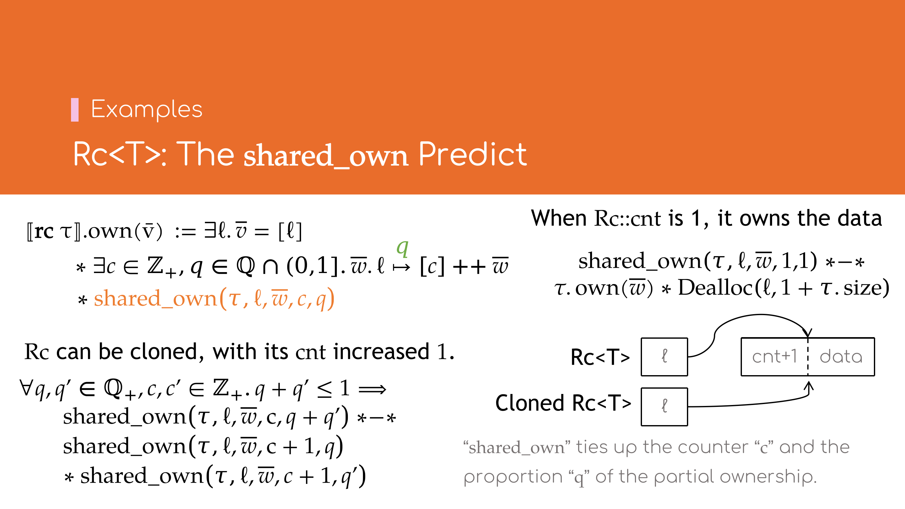
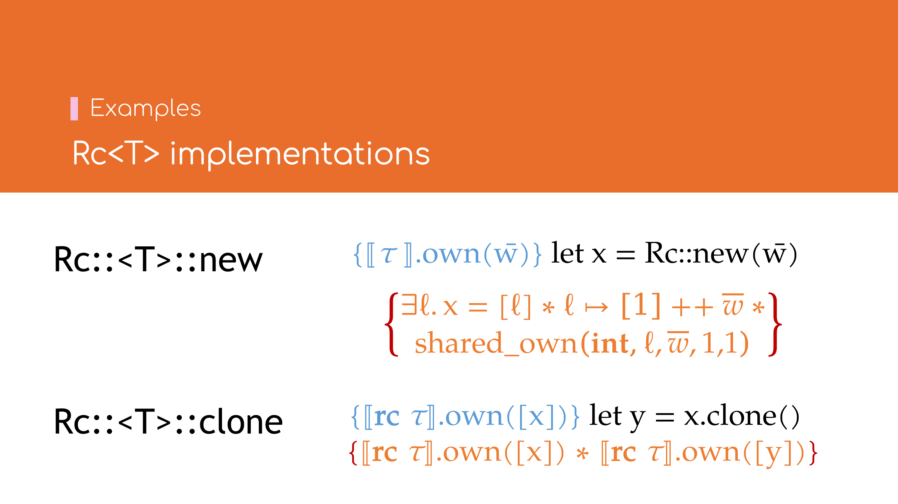
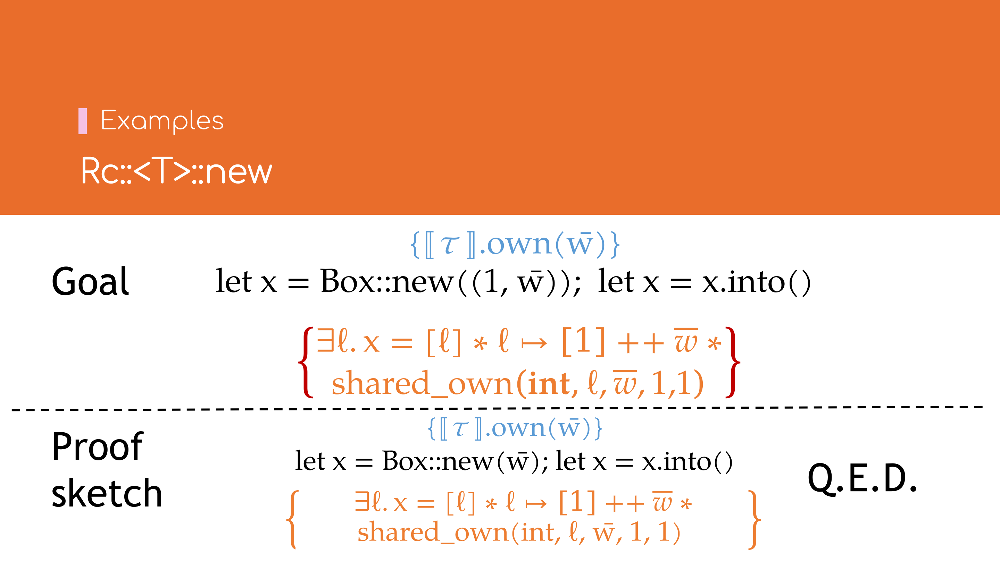
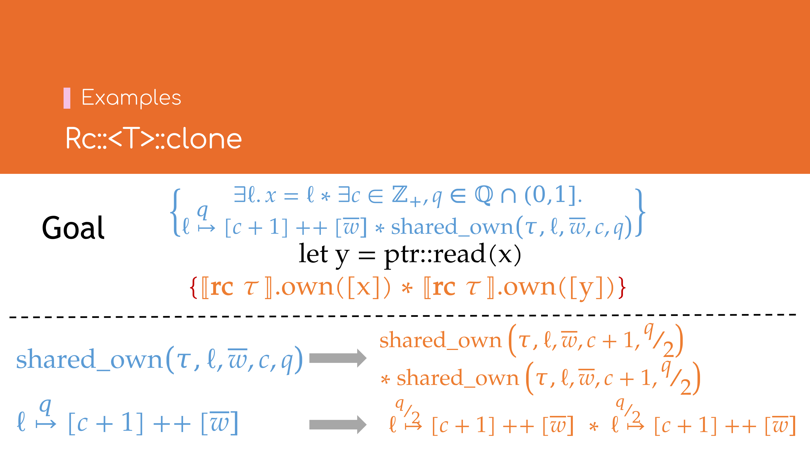
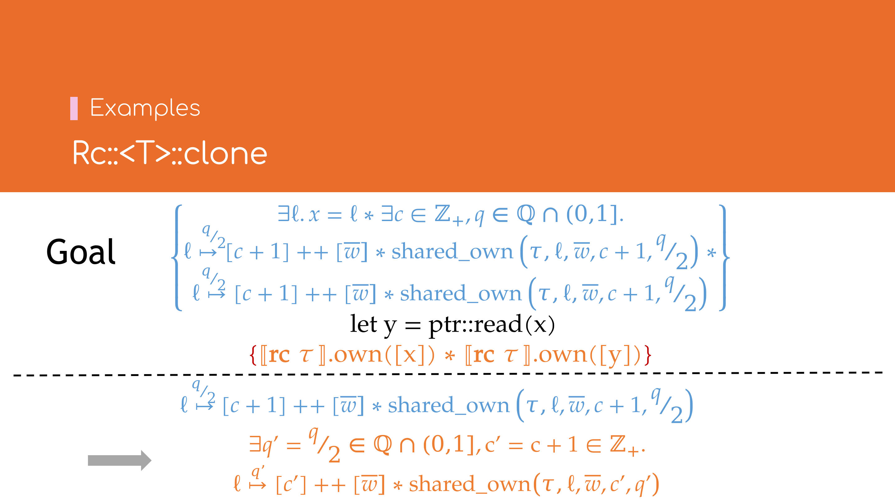

# 示例`Rc`

下面以[`Rc`类型](https://doc.rust-lang.org/std/rc/struct.Rc.html)为例，介绍其语义模型与实现．

## `Rc`的语义模型


若不考虑弱引用，`Rc`的内存布局可以看作一个指针，指向一个含引用计数与承载数据的内存地址．

在\\( \lambda\_\text{Rust} \\)中，引入\\( \mathbf{rc} \\, \tau \\)类型以代表`Rc<T>`类型，若按以下方式定义
\\[
\begin{array}{lll}
    [\\![ \mathbf{rc} \\, \tau ]\\!].\\!\text{size}
        & \mathrel{\mathop:}= 1 \\\\
    [\\![ \mathbf{rc} \\, \tau ]\\!].\\!\text{own}(\bar{v}) 
        & \mathrel{\mathop:}= \\, \exists \ell. \bar{v} = [\ell] 
        & \bar{v} \text{是单个地址值} \ell \\\\
        & \ast \\, \exists c \in \mathbb{Z}_{+}, \bar{w}. \ell \mapsto c :: \bar{w}
        & \ell \text{指向引用计数} c \text{与类型} \tau \text{的值} \bar{w} \\\\
        & \ast \\, ? & \text{应当如何表示共享所有权的值的约束？}
\end{array}
\\]
（其中\\(v :: l\\)表示将值\\(v\\)插入列表\\(l\\)的首部而得的新列表），但这样的问题在于：
1. \\( \ell \mapsto c :: \bar{w} \\)是独占所有权的，不能满足多个\\( \mathbf{rc} \\, \tau \\)类型共享所有权的要求；
2. 考虑到引用计数的存在，并不能简单地用\\( [\\![ \tau ]\\!].\\!\text{own}(\bar{w}) \\)来\\( \bar{w} \\)：
    - 当\\(c = 1\\)时，\\( \mathbf{rc} \\, \tau \\)表现为独占所有权，其语义与\\( \mathbf{own} \\, \tau \\)类型一致；
    - 当\\(c > 1\\)时，\\( \mathbf{rc} \\, \tau \\)表现为共享所有权．

对于1，可以参考[生存期token拆分](03-rust-semantics.md#生存期token的拆分)，为\\( \ell \mapsto P \\)赋予有理数份额\\(q\\)，
即\\( \ell \overset{q}{\mapsto} P \\)以表达部分所有权的语义．所有权拆分的方式如下
\\[
    \forall q, q' \in \mathbb{Q}\_1, \ell, P. q + q' \le 1 \implies
    \ell \overset{q + q'}{\longmapsto} P \\; \ast\\!-\\!\ast \\; (\ell \overset{q}{\mapsto} P) \ast (\ell \overset{q'}{\mapsto} P)
\\]

### \\(\text{shared\_own}\\) Predict[^shared-own]



将\\( \ell \mapsto c :: \bar{w} \\)拆分为部分份额后，还须建立部分所有权份额\\(q\\)与引用计数\\(c\\)之间的约束．简单起见，引入
\\[ \text{shared\_own} \mathrel{\mathop:}= SemType \times Loc \times List(Val) \times \mathbb{N}\_{+} \times \mathbb{Q}\_1 \to iProp \\]
再重新定义\\( [\\![ \mathbf{rc} \\, \tau ]\\!]\\!.\\!\text{own} \\)如下
\\[
\begin{array}{ll}
    [\\![ \mathbf{rc} \\, \tau ]\\!]\\!.\\!\text{own}(\bar{v}) 
        & \mathrel{\mathop:}= \\, \exists \ell. \bar{v} = [\ell] \\\\
        & \ast \\, \exists c \in \mathbb{Z}_{+}, q \in \mathbb{Q}_1, \bar{w}. \ell \overset{q}{\mapsto} c :: \bar{w} \\\\
        & \ast \\, \text{shared_own}(\tau, \ell, \bar{w}, c, q)
\end{array}
\\]

考察引用计数\\(c\\)与部分所有权份额\\(q\\)的关系：
- 当\\(c = 1\\)时，\\(q = 1\\)，且\\( \mathbf{rc} \\, \tau \\)的语义与\\( \mathbf{own} \\, \tau \\)一致，有
\\[
    \forall \tau, \ell, \bar{w}. \text{shared_own}(\tau, \ell, \bar{w}, 1, 1) \\; \ast\\!-\\!\ast \\;
    [\\![ \tau ]\\!].\\!\text{own}(\bar{w}) \ast \\, \mathsf{Dealloc}(\ell, 1 + [\\![ \tau ]\\!].\\!\text{size})
\\]
- 当引用计数\\(c\\)加一时，同时可将份额为\\(q + q'\\)的部分所有权拆分为两个更小份额\\(q\\)与\\(q'\\)的部分所有权
\\[
\begin{array}{l}
    \forall q, q' \in \mathbb{Q}\_1, c, c' \in \mathbb{Z}\_{+}, \tau, \ell, \bar{w}. q + q' \le 1 \implies \\\\
    \quad \text{shared_own}(\tau, \ell, \bar{w}, c, q + q') \ast\\!-\\!\ast \\\\
    \quad \text{shared_own}(\tau, \ell, \bar{w}, c + 1, q) \\\\
    \quad \ast\\, \text{shared_own}(\tau, \ell, \bar{w}, c + 1, q')
\end{array}
\\]
- 当\\(c > 1\\)时，\\( \mathbf{rc} \\, \tau \\)表现为共享所有权语义，该语义过于复杂，涉及Iris里面的高阶Ghost State的概念，此处暂不展开．

[^shared-own]: 因模型简化需要，该实现相比RustBelt论文，省略了大量细节．

## `Rc`的实现



下面以`Rc`类型中最常用的两个函数`Rc::new`与`Rc::clone`为例，介绍如何使用\\( \lambda\_\text{Rust} \\)验证其正确性．

### `Rc::new`的实现*



`Rc::new`简化后的逻辑如下
```rust,ignore
fn Rc::<T>::new(w: T) -> Rc<T> {
    let x = Box::new(Cons(1, w));
    x.into()
}
```
即先创建一个引用计数为`1`，值为`w`的`Box`，然后再将其转换为`Rc`（略去指针的实现细节，此处的类型转换可视为No-op）．

求证：
\\[
\big\lbrace [\\![ \tau ]\\!].\\!\text{own}(\bar{w}) \big\rbrace 
\\; \mathbf{let} \\, x = \text{Rc::new}(\bar{w}) \\;
\big\lbrace [\\![ \mathbf{rc} \\, \tau ]\\!].\\!\text{own}([x]) \big\rbrace
\\]

**证明**（概要）：

展开\\( \text{Rc::new} \\)及\\( [\\![ \mathbf{rc} \\, \tau ]\\!].\\!\text{own}([x]) \\)得
\\[
\begin{array}{lr}
    \big\lbrace [\\![ \tau ]\\!].\\!\text{own}(\bar{w}) \big\rbrace \\\\
    \quad \mathbf{let} \\, x = \text{Box::new}(1 :: \bar{w}) \\, ; & (1) \\\\
    \quad \mathbf{let} \\, x = x.\\!\text{into}() & (2) \\\\
    \left\lbrace \begin{array}{l} 
        \exists c \in \mathbb{Z}_{+}, q \in \mathbb{Q}_1. \left( x \overset{q}{\mapsto} c :: \bar{w} \right) \ast \\\\
        \text{shared_own}(\tau, x, \bar{w}, c, q)
    \end{array} \right\rbrace & (3)
\end{array}
\\]
对(1)应用\\( [\\![ \mathbf{own} \\, \tau ]\\!].\\!\text{own} \\)的定义，有
\\[
\begin{array}{lr}
    \big\lbrace [\\![ \tau ]\\!].\\!\text{own}(\bar{w}) \big\rbrace \\\\
    \quad \mathbf{let} \\, x = \text{Box::new}(1 :: \bar{w}) \\, ; \\\\
    \left\lbrace \begin{array}{l}
        (x \mapsto 1 :: \bar{w}) \ast [\\![ \tau ]\\!].\\!\text{own}(\bar{w}) \\, \ast \\\\
        \mathsf{Dealloc}(x, 1 + [\\![ \tau ]\\!].\\!\text{size})
    \end{array} \right\rbrace & (4)
\end{array}
\\]
对(2), (4)式应用\\( \\text{shared_own} \\)的第一个性质，得
\\[
\begin{array}{lr}
    \left\lbrace \begin{array}{l}
        (x \mapsto 1 :: \bar{w}) \ast [\\![ \tau ]\\!].\\!\text{own}(\bar{w}) \\, \ast \\\\
        \mathsf{Dealloc}(x, 1 + [\\![ \tau ]\\!].\\!\text{size})
    \end{array} \right\rbrace & (4) \\\\
    \quad \mathbf{let} \\, x = x.\\!\text{into}() & (2) \\\\
    \left\lbrace \begin{array}{l}
        \left( x \overset{1}{\mapsto} 1 :: \bar{w} \right) \ast \text{shared_own}(\tau, x, \bar{w}, 1, 1)
    \end{array} \right\rbrace & (5)
\end{array}
\\]
(5)式中令\\(c = 1, q = 1\\)得
\\[
\begin{array}{lr}
    \left\lbrace \begin{array}{l}
        \exists q = 1, c = 1.
        \left( x \overset{q}{\mapsto} c :: \bar{w} \right) \ast \text{shared_own}(\tau, x, \bar{w}, c, q)
    \end{array} \right\rbrace & (5')
\end{array}
\\]
(3)得证．\\(\square\\)


### `Rc::clone`的实现


`Rc::clone`简化后的逻辑如下
```rust,ignore
fn Rc::<T>::clone(x: &Rc<T>) -> Rc<T> { unsafe {
    (*x).0 += 1;
    let y = ptr::read(x);
    y
} }
```
即首先将其引用计数自增`1`，然后再将`x`的指针浅复制一份得到`y`．

求证：
\\[
\big\lbrace [\\![ \mathbf{rc} \\, \tau ]\\!].\\!\text{own}([x]) \big\rbrace 
\\; \mathbf{let} \\, y = x.\\!\text{clone}() \\;
\big\lbrace [\\![ \mathbf{rc} \\, \tau ]\\!].\\!\text{own}([x]) \ast [\\![ \mathbf{rc} \\, \tau ]\\!].\\!\text{own}([y]) \big\rbrace
\\]

**证明**（概要）：

展开\\( \text{Rc::clone} \\)，\\( [\\![ \mathbf{rc} \\, \tau ]\\!].\\!\text{own}([x]) \\)
及 \\( [\\![ \mathbf{rc} \\, \tau ]\\!].\\!\text{own}([y]) \\)得
\\[
\begin{array}{lr}
    \left\lbrace \begin{array}{l}
        \exists c \in \mathbb{Z}\_{+}, q \in \mathbb{Q}\_1. \left( x \overset{q}{\mapsto} c :: \bar{w} \right) \ast \\\\
        \text{shared_own}(\tau, x, \bar{w}, c, q)
    \end{array} \right\rbrace & (1) \\\\
    \quad ({\mbox*}x).0 \\, +\\!= 1 \\, ; & (2) \\\\
    \quad \mathbf{let} \\, y = \text{ptr::read}(x) & (3) \\\\
    \left\lbrace \begin{array}{l}
        \exists c', c'' \in \mathbb{Z}\_{+}, q', q'' \in \mathbb{Q}\_1. \\\\
        \left( x \overset{q'}{\mapsto} c' :: \bar{w} \right) \ast \text{shared_own}(\tau, x, \bar{w}, c', q') \\; \ast \\\\
        \left( y \overset{q''}{\mapsto} c'' :: \bar{w} \right) \ast \text{shared_own}(\tau, y, \bar{w}, c'', q'')
    \end{array} \right\rbrace & (4) \\\\
\end{array}
\\]
由(1), (2)式得
\\[
\begin{array}{lr}
    \left\lbrace \begin{array}{l}
        \exists c \in \mathbb{Z}\_{+}, q \in \mathbb{Q}\_1. \left( x \overset{q}{\mapsto} c :: \bar{w} \right) \ast \\\\
        \text{shared_own}(\tau, x, \bar{w}, c, q)
    \end{array} \right\rbrace & (1) \\\\
    \quad ({\mbox*}x).0 \\, +\\!= 1 \\, ; & (2) \\\\
    \left\lbrace \begin{array}{l}
        \exists c \in \mathbb{Z}\_{+}, q \in \mathbb{Q}\_1. \left( x \overset{q}{\mapsto} (c + 1) :: \bar{w} \right) \ast \\\\
        \text{shared_own}(\tau, x, \bar{w}, c, q)
    \end{array} \right\rbrace & (5) \\\\
\end{array}
\\]
现须证
\\[
\begin{array}{lr}
    \left\lbrace \begin{array}{l}
        \exists c \in \mathbb{Z}\_{+}, q \in \mathbb{Q}\_1. \left( x \overset{q}{\mapsto} (c + 1) :: \bar{w} \right) \ast \\\\
        \text{shared_own}(\tau, x, \bar{w}, c, q)
    \end{array} \right\rbrace & (5) \\\\
    \quad \mathbf{let} \\, y = \text{ptr::read}(x) & (3) \\\\
    \left\lbrace \begin{array}{l}
        \exists c', c'' \in \mathbb{Z}\_{+}, q', q'' \in \mathbb{Q}\_1. \\\\
        \left( x \overset{q'}{\mapsto} c' :: \bar{w} \right) \ast \text{shared_own}(\tau, x, \bar{w}, c', q') \\; \ast \\\\
        \left( y \overset{q''}{\mapsto} c'' :: \bar{w} \right) \ast \text{shared_own}(\tau, y, \bar{w}, c'', q'')
    \end{array} \right\rbrace & (4) \\\\
\end{array}
\\]



应用\\( \text{shared_own} \\)的第二个性质，将(5)式中的\\( \text{shared_own}(\tau, x, \bar{w}, c, q) \\)拆分为两个\\( {}^q/{}\_2 \\)的份额
\\[
\begin{array}{l}
    \text{shared_own}(\tau, x, \bar{w}, c, q) \\; -\\!\ast \\\\
        \quad \text{shared_own}(\tau, x, \bar{w}, c + 1, {}^q/{}\_2) \\; \ast \\\\
        \quad \text{shared_own}(\tau, x, \bar{w}, c + 1, {}^q/{}\_2)
\end{array}
\\]
再将\\( x \overset{q}{\mapsto} (c + 1) :: \bar{w} \\)也拆成两个\\( {}^q/{}\_2 \\)的份额
\\[
x \overset{q}{\mapsto} (c + 1) :: \bar{w} \\; -\\!\ast \\;
\left( x \overset{{}^q/{}\_2}{\mapsto} (c + 1) :: \bar{w} \right) \ast \left( x \overset{{}^q/{}\_2}{\mapsto} (c + 1) :: \bar{w} \right)
\\]



得
\\[
\begin{array}{lr}
    \left\lbrace \begin{array}{l}
        \exists c \in \mathbb{Z}\_{+}, q \in \mathbb{Q}\_1. \\\\
        \left( x \overset{{}^q/{}\_2}{\mapsto} (c + 1) :: \bar{w} \right) \ast
        \left( x \overset{{}^q/{}\_2}{\mapsto} (c + 1) :: \bar{w} \right) \ast \\\\
        \text{shared_own}(\tau, x, \bar{w}, c + 1, {}^q/{}\_2) \\; \ast \\\\
        \text{shared_own}(\tau, x, \bar{w}, c + 1, {}^q/{}\_2)
    \end{array} \right\rbrace & (5')
\end{array}
\\]


令\\( q' = q'' = {}^q/{}\_2 \\)，\\(c' = c'' = c + 1\\)，则
\\[
\begin{array}{lr}
    \left\lbrace \begin{array}{l}
        \exists c', c'' = c + 1, q', q'' = {}^q/{}\_2. \\\\
        \left( x \overset{q'}{\mapsto} c' :: \bar{w} \right) \ast \text{shared_own}(\tau, x, \bar{w}, c', q') \\; \ast \\\\
        \left( x \overset{q''}{\mapsto} c'' :: \bar{w} \right) \ast \text{shared_own}(\tau, x, \bar{w}, c'', q'')
    \end{array} \right\rbrace & (5'') \\\\
    \quad \mathbf{let} \\, y = \text{ptr::read}(x) & (3) \\\\
    \left\lbrace \begin{array}{l}
        \exists c', c'' \in \mathbb{Z}\_{+}, q', q'' \in \mathbb{Q}\_1. \\\\
        \left( x \overset{q'}{\mapsto} c' :: \bar{w} \right) \ast \text{shared_own}(\tau, x, \bar{w}, c', q') \\; \ast \\\\
        \left( y \overset{q''}{\mapsto} c'' :: \bar{w} \right) \ast \text{shared_own}(\tau, y, \bar{w}, c'', q'')
    \end{array} \right\rbrace & (4) \\\\
\end{array}
\\]
(3)式中的\\( \text{ptr::read} \\)为浅复制，因此上式不难得证．\\(\square\\)
